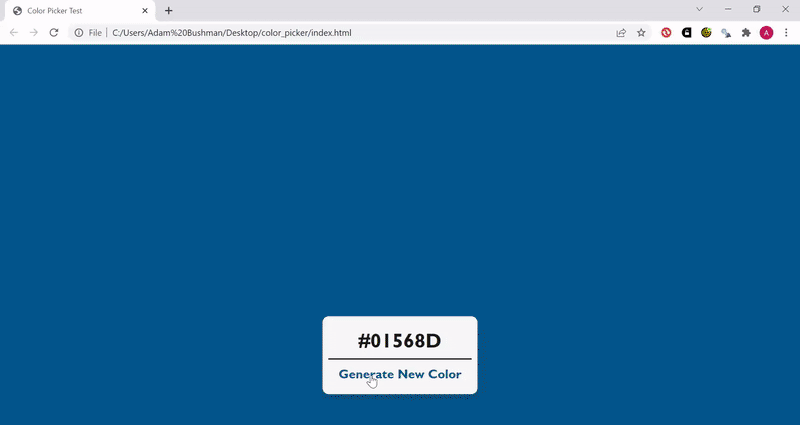

# Random Color Picker

A web tool that generates a random color by user click, displays it as the webpage background, and shows the hexadecimal value.

## Description

A web tool that generates a random color by user click, displays it as the webpage background, and shows the hexadecimal value. It's a simple version inspired by [Coolors](https://www.coolors.co).

In this repository you'll find the HTML, CSS, and JavaScript files used to make the simple web tool. 

[Take it for a spin](https://adambushman.github.io/random-color-picker/) and find some neat colors.

## Blog Post
[Random Color Picker](https://www.adam-bushman.com/blog_posts/blog_random-color-picker_006.html)
